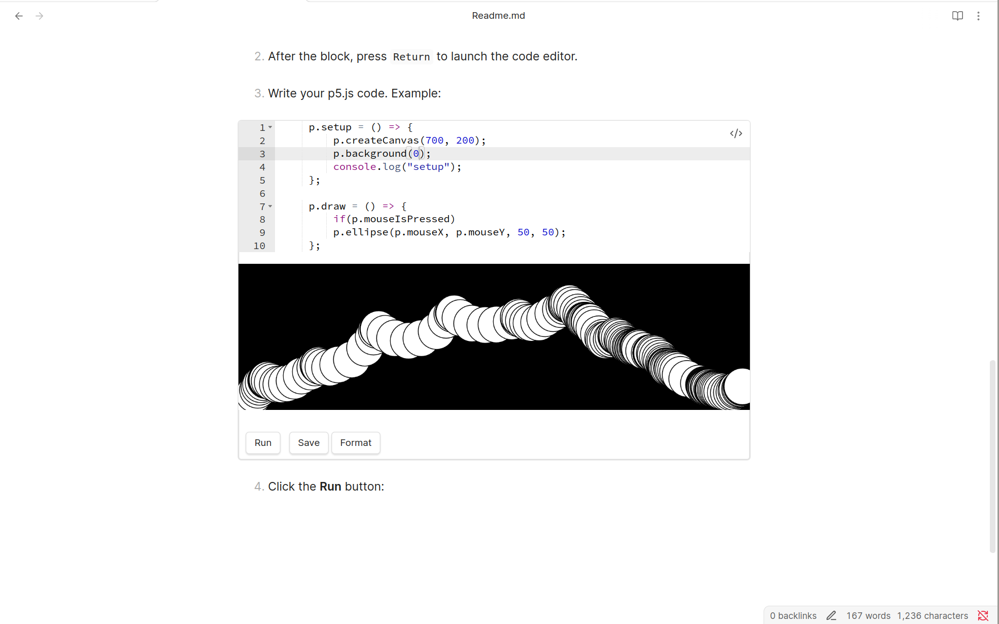
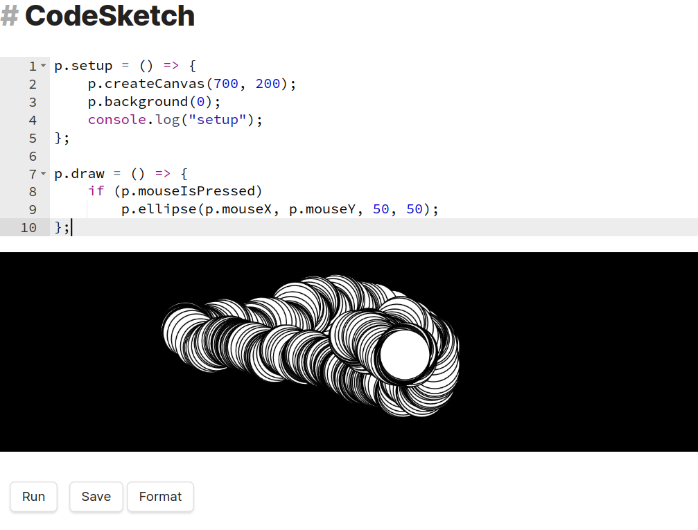

# CodeSketch

  **CodeSketch** is a simple Obsidian plugin that enables live-editable, interactive p5.js code blocks directly within your notes.

  Perfect for creative coding, demos, and learning p5.js without leaving Obsidian.


  ---

## Features

  - Adds a new `p5` code block type.
  - Inline code editor with syntax highlighting.
  - Interactive sketch display within Obsidian.
  - Instant feedback: Edit and run p5.js sketches in-place.

  ---

## 🛠 Installation

  1. Clone the plugin into your Obsidian vault’s plugin directory:
     ```sh
     git clone https://github.com/aelsayd/CodeSketch.git
     mv CodeSketch ~/your-vault/.obsidian/plugins
     ```

  2. Open Obsidian and go to:
     `Settings` → `Community Plugins` → Enable **CodeSketch**

  ---

## How to Use

  1. Add a `p5` code block in your note:
     ```p5
     // your code here
     ```

  2. After the block, press `Return` to launch the code editor.

  3. Write your p5.js code. Example:

     ```js
     p.setup = () => {
         p.createCanvas(700, 200);
         p.background(0);
         console.log("setup");
     };

     p.draw = () => {
         p.ellipse(p.mouseX, p.mouseY, 50, 50);
     };
     ```

  4. Click the **Run** button:  
     
